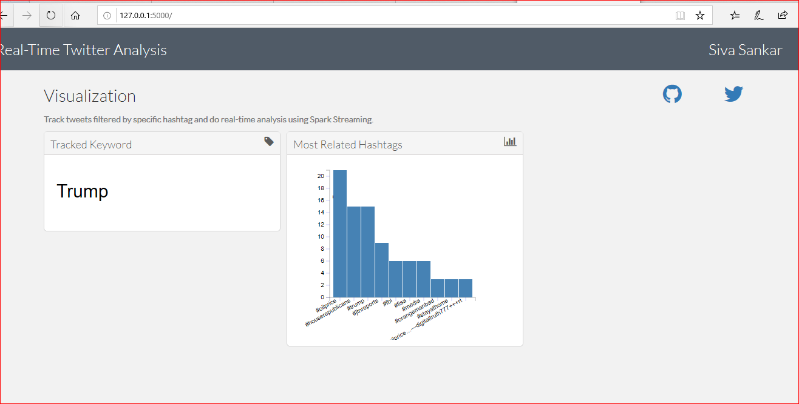

# find-top-hashtags-twitter
Do real-time analysis on the tweets, find the top #Hashtags from twitter data

Tools & Technologies:

•	Tweepy (And your own pair of API Keys from Twitter);
•	Pyspark (Python 3.7, Spark 2.4);
•	Jupyter Notebook;
•	Spark Streaming;
•	Spark SQL;
•	pymongo;
•	MongoDB;

Set your credentials on config.json file to get Twitter API access.

{ "asecret": "XXX...XXX",
  "atoken":  "XXX...XXX",
  "csecret": "XXX...XXX",
  "ckey":    "XXX...XXX" }
  
Modify the parameters.json file to set your own parameters
  
Start MongoDB Database process to store the data into MongoDB

Implementation:

Twitter API
•	Use the tweepy Twitter API to stream tweets 
•	Filter out the tweets containing the specific keywords / hashtags we want to track. 
•	To give the tweets to the spark job, using TCP / IP socket 
Connect to Twitter
•	Create a new app on Twitter account and configure the OAuth credentials. 
•	1. Go to https://apps.twitter.com/ . Sign in and click the Create New App button 
•	2. Complete the required fields: 
•	 Name and Description can be anything you want. 
•	 Website. Enter any valid URL. 
•	3. Below the developer agreement, turn on the Yes, I agree check box and click Create your Twitter application. 
•	4. Click the Keys and Access Tokens tab. 
•	5. Scroll to the bottom of the page and click the Create My Access Tokens button. 
•	6. Copy Consumer Key, Consumer Secret, Access Token, Access Token Secret. 

Do Real-time Analysis
•	Using Spark Streaming to real-time tweet review 
•	Clean the tweets
•	Locate the most important hashtags

Database
•	Using MongoDB to store the results of an study 

Visualization (Output)
•	Run dashboard\dashboard.py

•	Timeline of related most related hashtags, search keyword
•	Now can browse localhost:5000 to see the output

HOW TO RUN:

1. run twitterstream.py file from command prompt
	python twitterstream.py

2. Then run tweetAnalysis from jupyter notebook (open anaconda prompt and type "jupyter notebook", this opens jupyter notebook 

3. Then run dashboard/dashboard.py file from the command prompt
	py dashboard/dashboard.py

4. Now can browse localhost:5000 to see the output

  
NOTE: Refer documentation.doc file for full details
